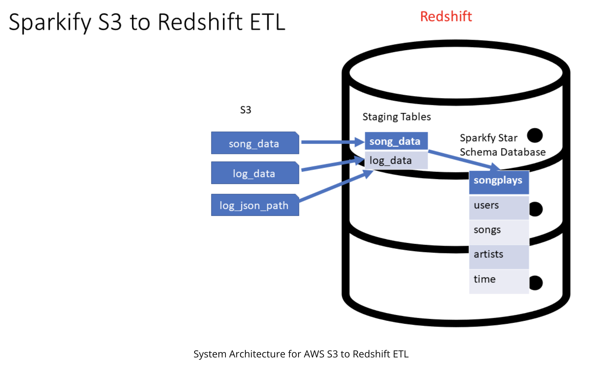

### PROJECT: BUILDING ETL PIPELINE
---

### 1. Introduction
In this project, I build an ETL pipeline for a database hosted on Redshift. I will need to:
    - extract data from S3 to staging tables on Redshift
    - transform data by executing SQL statements that create the analytics tables from these staging tables by start schema.
    - load star shema tables to Redshift


    
### 2. Tech Stack and Knowledge

- Data warehouse knowledge
    - Dimensional Modeling
    - ETL
    - OLAP Cubes
    - Data warehouse Architecture
    - Optimizing Table Design using Distribution and Sort Styles
- Tech/Framework used
    - AWS S3
    - AWS Redshift
    - AWS IAM
    - Python
    - SQL
    - Python SDK for AWS (boto3)
    - Infrastructure as a Code (IaC)

### 3. Project Introduction

#### 3.1 About
A music streaming startup, Sparkify, has grown their user base and song database and want to move their processes and data onto the cloud. Their data resides in S3, in a directory of JSON logs on user activity on the app, as well as a directory with JSON metadata on the songs in their app.

#### 3.2 Raw data
The raw data consists of two datasets stored in S3: song_data and log_data. Here are the S3 links for each:

- Song data: **s3://udacity-dend/song_data**
- Log data: **s3://udacity-dend/log_data**

#### 3.3 Data Warehouse Design

**Staging tables**


**Star Schema tables**


#### 3.4 ETL PIPELINE

- CREATE STAGING TABLES
    - Staging_events
    ```
    CREATE TABLE IF NOT EXISTS "staging_events" (
        artist             varchar,
        auth               varchar,
        firstName          varchar,
        gender             varchar,
        itemInSession      int,
        lastName          varchar,
        length             decimal,
        level              varchar,
        location           varchar,
        method             varchar,
        page               varchar,
        registration       decimal,
        sessionId          varchar,
        song               varchar,
        status             int,
        ts                 bigint,
        userAgent          varchar,
        userId             varchar
    );
    ```
    - Staging_songs
    ```
    CREATE TABLE "staging_songs" (
        num_songs          int,
        artist_id          varchar,
        artist_latitude    decimal,
        artist_longitude   decimal,
        artist_location    varchar,
        artist_name        varchar,
        song_id            varchar,
        title              varchar,
        duration           decimal,
        year               int
    );
    ```
- CREATE FACT AND DIM TABLES
    - dimUser: I choose userId as a sortkey
    ```
    CREATE TABLE IF NOT EXISTS "dimUser" (
        user_id            int sortkey,
        first_name         varchar,
        last_name          varchar,
        gender             varchar,
        level              varchar
    );
    ```
    - dimArtist: I choose artist_id as a sortkey
    ```
    CREATE TABLE IF NOT EXISTS "dimArtist" (
        artist_id         varchar sortkey,
        name              varchar,
        location          varchar,
        latitude          decimal,
        longitude         decimal
    );
    ```
    - dimSong: I choose song_id as a sortkey
    ```
    CREATE TABLE IF NOT EXISTS "dimSong" (
        song_id            varchar sortkey,
        title              varchar,
        artist_id          varchar,
        year               int,
        duration           decimal
    );
    ```
    - dimTime: I choose start_time as a sortkey
    ```
     CREATE TABLE IF NOT EXISTS "dimTime" (
        start_time        timestamp sortkey,
        hour              int,
        day               int,
        week              int,
        month             int,
        year              int,
        weekday           int
    );
    ```
- COPY DATASET from S3 to Redshift
```
staging_events_copy = ("""
    copy staging_events from {}
    iam_role {}
    format as JSON 'auto' 
    region 'us-west-2';
""").format(config.get('S3', 'LOG_DATA'), config.get('IAM_ROLE', 'ARN'))

staging_songs_copy = ("""
    copy staging_songs from {}
    iam_role {}
    format as JSON 'auto' 
    region 'us-west-2';
""").format(config.get('S3', 'SONG_DATA'), config.get('IAM_ROLE', 'ARN'))
```
- TRANSFORM DATA to STAR SCHEMA TABLES
    - Insert data into dimUser
    ```
    INSERT INTO dimUser (user_id, first_name, last_name, gender, level)
    (SELECT 
        DISTINCT CAST(userId as int),
        firstname,
        lastname,
        gender,
        level
    FROM staging_events 
    WHERE userId IS NOT NULL)
    """)
    ```
    - Insert data into dimSong
    ```
       INSERT INTO dimSong (song_id, title, artist_id, year, duration)
        (SELECT
            DISTINCT song_id,
            title,
            artist_id,
            year,
            duration
        FROM staging_songs
        WHERE song_id IS NOT NULL
        )
    """)
    ```
    - Insert data into dimArtist
    ```
    INSERT INTO dimArtist (artist_id, name, location, latitude, longitude)
    (SELECT 
        DISTINCT artist_id,
        artist_name,
        artist_location,
        artist_latitude,
        artist_longitude
     FROM staging_songs
     WHERE artist_id IS NOT NULL)
    """)
    ```
    - Insert data into dimTime 
    ```
    INSERT INTO dimTime (start_time, hour, day, week, month, year, weekday)
    (SELECT
        st.start_time,
        EXTRACT(HOUR from st.start_time) as hour,
        EXTRACT(DAY from st.start_time) as day,
        EXTRACT(WEEK from st.start_time) as week,
        EXTRACT(WEEK from st.start_time) as month,
        EXTRACT(YEAR from st.start_time) as year,
        EXTRACT(WEEKDAY from st.start_time) as weekday 
    FROM 
        (SELECT TIMESTAMP 'epoch' + se.ts/1000 * INTERVAL '1 second' as start_time
        FROM staging_events se) st
    )
    """)
    ```
    - Insert data into factSongPlay
    ```
    INSERT INTO factSongPlay (start_time, user_id, level, song_id, artist_id, session_id, location, user_agent)
    (SELECT
        TIMESTAMP 'epoch' + se.ts/1000 * INTERVAL '1 second' as start_time,
        cast(se.userId as int),
        se.level,
        ss.song_id,
        ss.artist_id,
        cast(se.sessionId as int),
        se.location,
        se.userAgent
    FROM staging_events se
    LEFT OUTER JOIN staging_songs ss ON (se.song = ss.title AND se.artist = ss.artist_name)
    WHERE se.page = 'NextSong'
    )
    """)
    ```
- CREATE IAM, CLUSTER
    - CREATE IAM ROLE 
        ```
        try:
            print("1.1 Creating a new IAM Role") 
            dwhRole = iam.create_role(
                Path='/',
                RoleName=DWH_IAM_ROLE_NAME,
                Description = "Allows Redshift clusters to call AWS services on your behalf.",
                AssumeRolePolicyDocument=json.dumps(
                    {'Statement': [{'Action': 'sts:AssumeRole',
                    'Effect': 'Allow',
                    'Principal': {'Service': 'redshift.amazonaws.com'}}],
                    'Version': '2012-10-17'})
            )    
        except Exception as e:
            print(e)
        ```

    - ATTACHING POLICTY
        ```
        iam.attach_role_policy(RoleName=DWH_IAM_ROLE_NAME,
                       PolicyArn="arn:aws:iam::aws:policy/AmazonS3ReadOnlyAccess"
                      )['ResponseMetadata']['HTTPStatusCode']

        print("1.3 Get the IAM role ARN")
        roleArn = iam.get_role(RoleName=DWH_IAM_ROLE_NAME)['Role']['Arn']

        print(roleArn)
        ```
    - CREATE CLUSTER
        ```
        try:
            response = redshift.create_cluster(        
                #HW
                ClusterType=DWH_CLUSTER_TYPE,
                NodeType=DWH_NODE_TYPE,
                NumberOfNodes=int(DWH_NUM_NODES),

                #Identifiers & Credentials
                DBName=DWH_DB,
                ClusterIdentifier=DWH_CLUSTER_IDENTIFIER,
                MasterUsername=DWH_DB_USER,
                MasterUserPassword=DWH_DB_PASSWORD,
                
                #Roles (for s3 access)
                IamRoles=[roleArn]  
            )
        except Exception as e:
            print(e)
        ```
     - GET CLUSTER ENDPOINT and ARN
        ```
        DWH_ENDPOINT = myClusterProps['Endpoint']['Address']
        DWH_ROLE_ARN = myClusterProps['IamRoles'][0]['IamRoleArn']
        print("DWH_ENDPOINT :: ", DWH_ENDPOINT)
        print("DWH_ROLE_ARN :: ", DWH_ROLE_ARN)
        ```
    - CONNECT TO THE CLUSTER
        ```
        conn_string="postgresql://{}:{}@{}:{}/{}".format(DWH_DB_USER, DWH_DB_PASSWORD, DWH_ENDPOINT, DWH_PORT,DWH_DB)
        print(conn_string)
        %sql $conn_string
        ```
    - RUN ```sql_queries.py``` to create, drop and insert data. 
    - RUN ```etl.py``` to load and transform data.
    
 ### Some Insights
#### 1. Top 10 songs played the most
     ```
     select
        count(*) as number_of_plays,
        ds.title as title
    from factsongplay f
    LEFT JOIN dimSong ds on f.song_id = ds.song_id
    group by ds.title
    ORDER BY number_of_plays DESC
    limit 10;
    ```


#### 2. The most traffic hour
    ```
    select
        count(*) as number_of_plays,
        dt.hour as hour
    from factsongplay f
    LEFT JOIN dimTime dt on f.start_time = dt.start_time
    group by dt.hour
    ORDER BY number_of_plays DESC
    limit 10;
    ```

#### 3. The most traffic weekday and hour
    ```
    select 
        count(*) as num_of_plays,
        dt.weekday as weekday,
        dt.hour as hour
        from factsongplay f
    LEFT JOIN dimtime dt ON dt.start_time = f.start_time
    group by dt.weekday, dt.hour
    order by num_of_plays desc
    limit 10;
    ```
